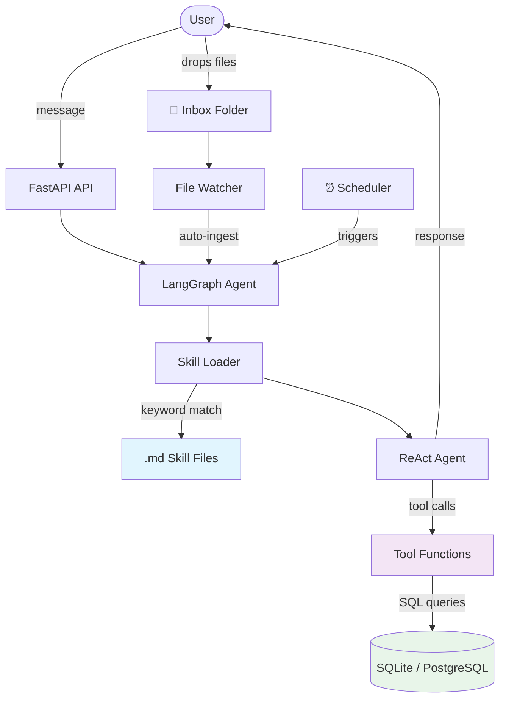
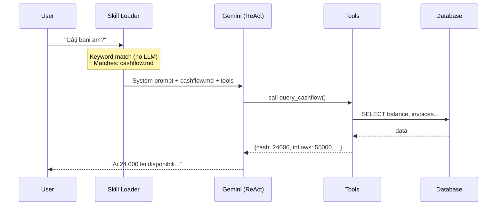
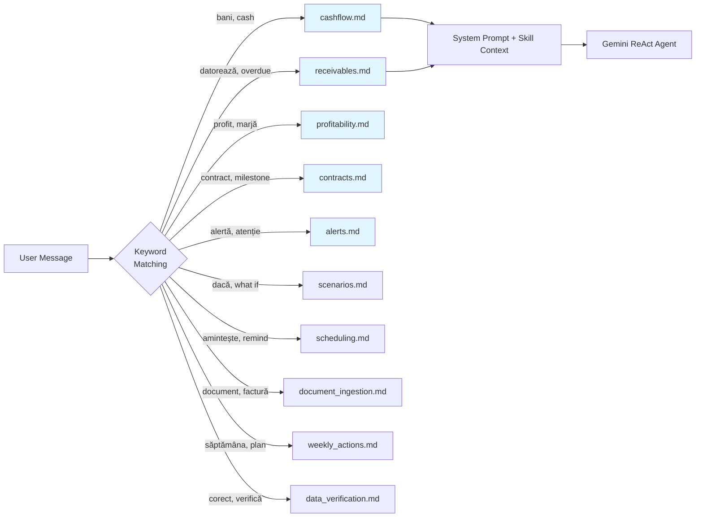
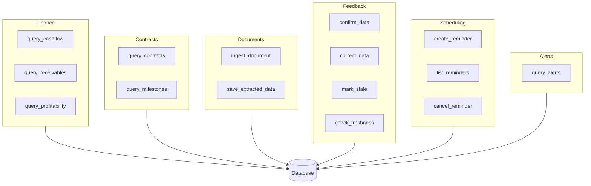
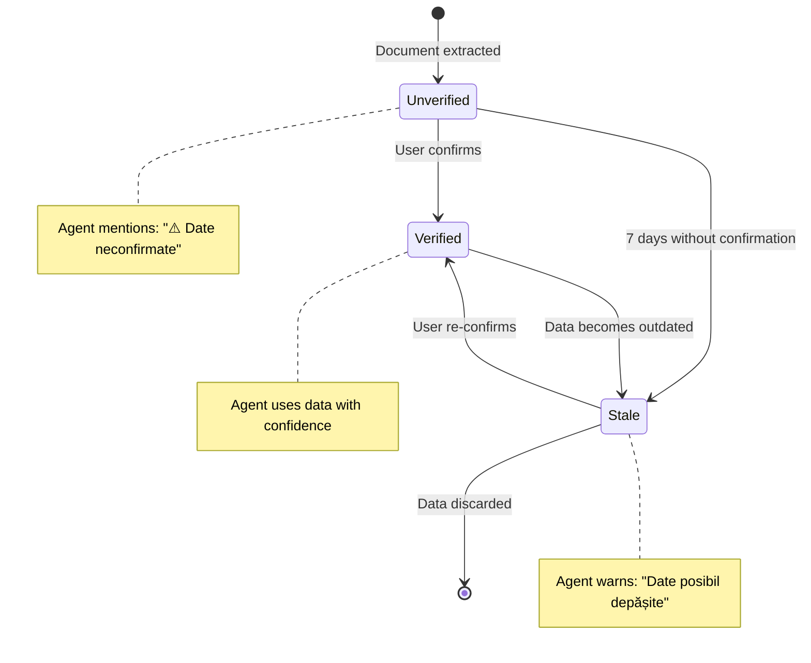
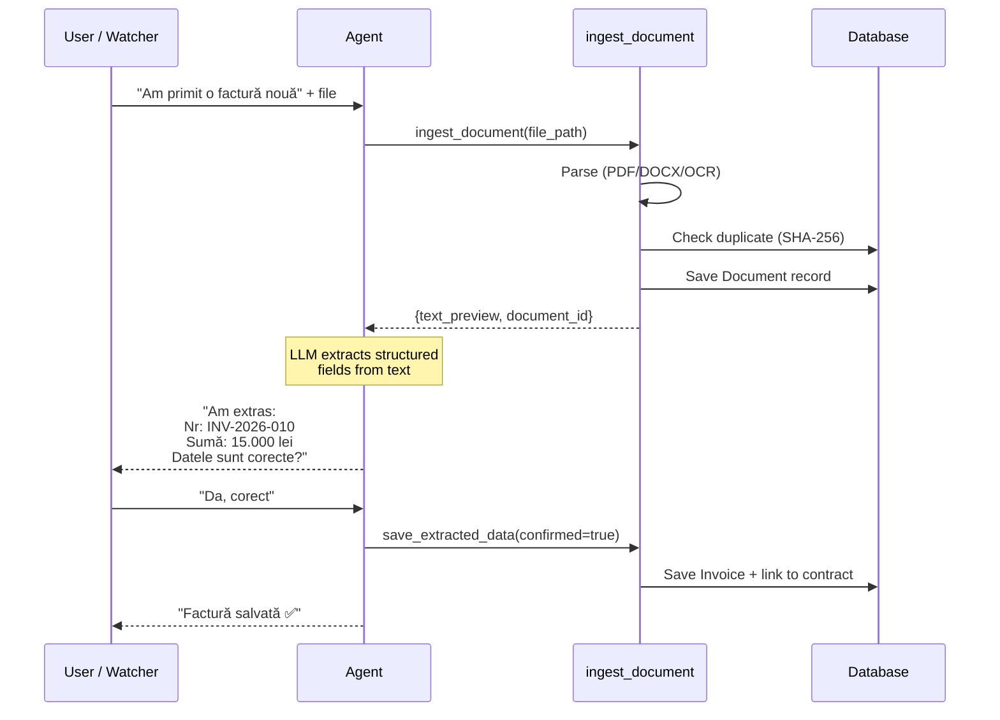
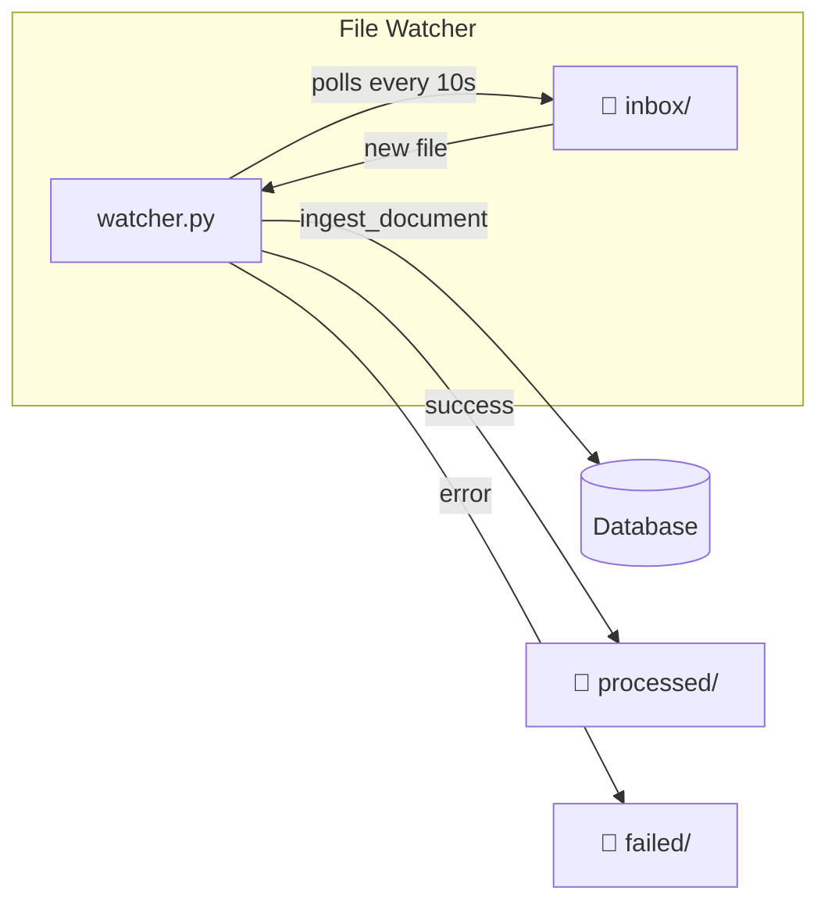
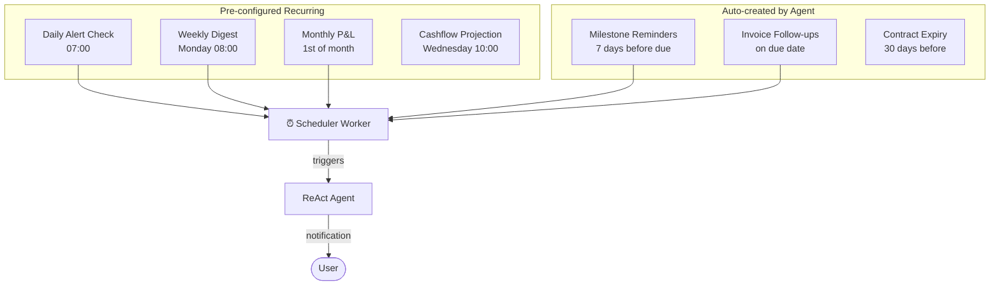
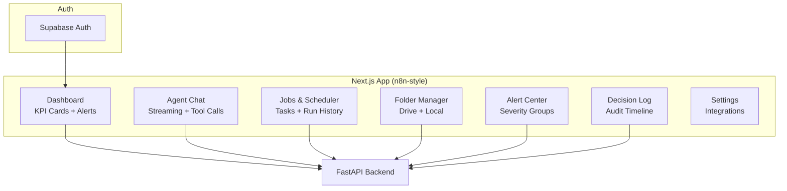

# Clarifi — Architecture

AI financial assistant for Romanian services companies. Provides cashflow visibility, contract tracking, invoice management, alerts, and decision support through a conversational interface.

## High-Level Overview



## Core Architecture: Skills + Tools + ReAct Agent

Clarifi uses a **single LLM call per user turn**, not the traditional router → executor → synthesizer pattern (which costs 2-3 calls).



### Why this design?

| Approach | LLM Calls | Cost | Latency |
|----------|-----------|------|---------|
| Router → Skill → Synthesizer | 2-3 | High | Slow |
| **Clarifi (Skill + ReAct)** | **1** | **Low** | **Fast** |

## Skills (`.md` files)

Skills are markdown files that tell the LLM what tools to use and how to respond. They are loaded into the LLM's context based on keyword matching — **no LLM call needed for routing**.



Each `.md` file contains:
- **Keywords** — for matching (Romanian + English)
- **Tools** — which tools to bind for this skill
- **Instructions** — what the LLM should do
- **Response format** — how to format the answer
- **Examples** — few-shot examples of good responses

## Tools (Python functions)

Tools are `@tool` decorated async functions that the LLM calls via LangChain tool-calling. They handle all database queries and business logic.



## Data Model

```mermaid
erDiagram
    Company ||--o{ Contract : counterparty
    Company ||--o{ Invoice : issuer/recipient
    Project ||--o{ Contract : contains
    Project ||--o{ Invoice : tracks
    Contract ||--o{ ContractMilestone : has
    Contract ||--o{ ContractObligation : has
    Contract ||--o{ ContractPenalty : has
    Contract ||--o{ Invoice : generates
    Contract ||--o{ Estimate : links
    Invoice ||--o{ InvoiceLineItem : contains
    Invoice ||--o{ PaymentInvoiceMatch : matched_to
    BankTransaction ||--o{ PaymentInvoiceMatch : matches
    Document ||--o{ DocumentProcessingLog : logs

    Company {
        string id PK
        string legal_name
        string tax_id UK
        enum role "client/supplier/own"
    }
    Contract {
        string id PK
        string contract_number UK
        decimal total_value
        date start_date
        date end_date
        enum status
    }
    Invoice {
        string id PK
        string invoice_number
        enum direction "issued/received"
        enum status
        decimal total_amount
        decimal amount_remaining
        date due_date
        string freshness_status
    }
    BankTransaction {
        string id PK
        string bank_account_iban
        date transaction_date
        decimal amount
        decimal balance_after
        bool is_matched
    }
    Project {
        string id PK
        string project_code UK
        string name
        decimal budget
        enum status
    }
```

## Data Freshness System

Every key entity tracks whether it has been verified by the user:



## Document Ingestion Flow



## File Discovery



## Scheduled Tasks



## Project Structure

```
clarifi/
├── src/clarifi/
│   ├── config.py              # Settings (pydantic-settings, .env)
│   ├── llm.py                 # LLM factory (cached singleton)
│   ├── main.py                # FastAPI application
│   ├── agent/
│   │   ├── graph.py           # LangGraph: skill_loader → agent → END
│   │   └── prompts.py         # System prompt (Romanian context)
│   ├── skills/                # .md files loaded into LLM context
│   │   ├── loader.py          # Keyword-based skill selector
│   │   ├── cashflow.md
│   │   ├── receivables.md
│   │   ├── profitability.md
│   │   ├── contracts.md
│   │   ├── alerts.md
│   │   ├── risk_analysis.md
│   │   ├── scenarios.md
│   │   ├── scheduling.md
│   │   ├── document_ingestion.md
│   │   ├── weekly_actions.md
│   │   └── data_verification.md
│   ├── tools/                 # @tool functions (DB queries)
│   │   ├── finance.py         # cashflow, receivables, profitability
│   │   ├── contracts.py       # contracts, milestones
│   │   ├── alerts.py          # alerts
│   │   ├── documents.py       # ingest, save
│   │   ├── feedback.py        # confirm, correct, mark_stale
│   │   └── scheduling.py      # reminders
│   ├── models/                # SQLAlchemy ORM (18 tables)
│   ├── db/session.py          # Async session factory
│   ├── ingestion/             # Document parsers (PDF, DOCX, OCR)
│   ├── discovery/watcher.py   # Folder watcher
│   └── api/                   # FastAPI endpoints
├── scripts/
│   ├── seed_db.py             # Test data (SC Digital Solutions SRL)
│   ├── run_scheduler.py       # Background scheduler worker
│   └── run_watcher.py         # File watcher daemon
└── tests/                     # 25 tests (skill loader + tools)
```

## Frontend (Next.js)



## Technology Stack

| Component | Technology |
|-----------|-----------|
| Frontend | Next.js 15 + React 19 + Tailwind CSS 4 |
| Auth | Supabase Auth (email, Google OAuth) |
| Agent Framework | LangGraph (ReAct prebuilt agent) |
| LLM | Google Gemini (via langchain-google-genai) |
| API | FastAPI (REST + WebSocket) |
| Database | SQLAlchemy async (SQLite dev / PostgreSQL prod) |
| Document Parsing | pypdf, python-docx, pytesseract (OCR) |
| Task Scheduling | croniter + custom scheduler worker |
| File Discovery | watchfiles + custom watcher |
| Planned | Google Drive API, Telegram Bot API |
